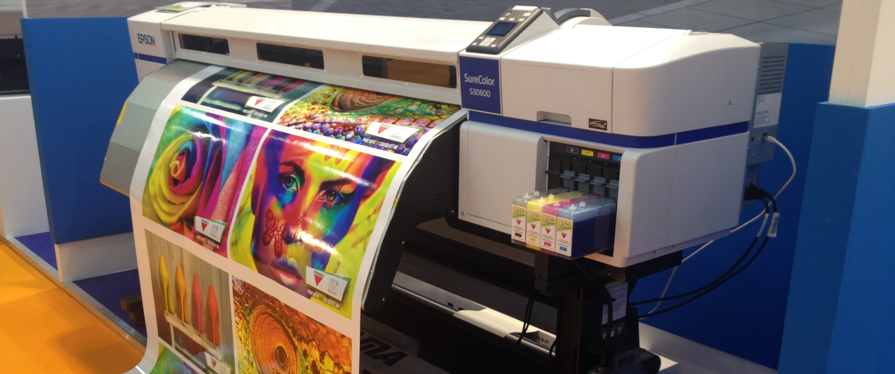

# Print Test

A printer test page is one of the easiest and most effective ways to analyze and calibrate your printer's performance.

Test pages often include text, graphics, and images that, when printed, aim to maintain the health of your printer (and cartridges) while highlighting any issues that your printer may be having.

